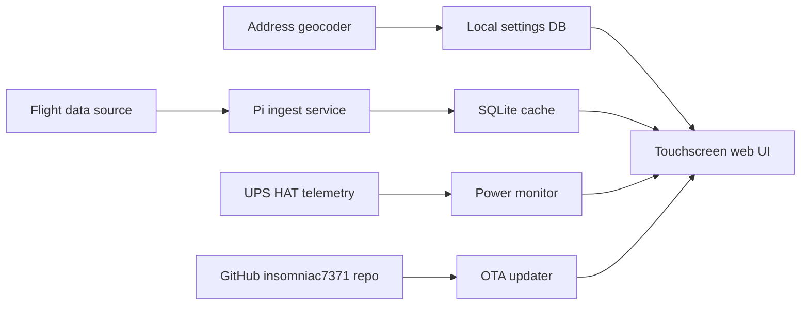

# System Architecture

## Hardware

Recommended physical stack:

- Raspberry Pi 5
- 7-inch 800x480 capacitive touchscreen
- UPS HAT with safe-shutdown signal or readable battery/power telemetry
- USB-C panel mount extension for main power
- Momentary push button for local power or safe-shutdown action
- Custom 3D printed case with airflow, screen support, cable strain relief, and access to the SD card

## Software Components

## Local Services

- `flightd`: polls flight providers, normalizes aircraft, classifies category, writes cache
- `powerd`: watches UPS state and manages the 5 minute graceful-shutdown timer
- `updated`: checks GitHub for releases or repo updates and applies approved updates
- `web`: serves the UI and settings API locally

## Data Model Sketch

- `settings`: key/value settings for location, range, units, update channel, and display
- `aircraft`: current normalized aircraft state keyed by ICAO hex or provider ID
- `sightings`: recent observations near the configured location
- `providers`: data-source health, last success, last error, latency
- `images`: aircraft image URL/cache metadata

## Flight Data Options

Best options to evaluate:

- Local ADS-B receiver: most self-contained, no API limits, needs antenna and receiver hardware
- ADSB.lol / ADS-B Exchange style feeds: rich data, terms and access vary
- OpenSky Network: useful but can be rate-limited and incomplete
- FlightAware / commercial APIs: polished but often paid or restricted

For the first working gift build, design the software so the provider can be swapped without rewriting the UI.

## OTA Update Model

Simple and robust approach:

- App runs from a GitHub-backed repo on the Pi
- Owner profile is `https://github.com/insomniac7371`
- Suggested repository is `insomniac7371/dad-flight-tracker`
- Update check fetches release metadata or `git fetch`
- UI shows current version and available version
- User taps update
- Updater stops services, pulls/replaces files, installs dependencies, restarts
- Failed update rolls back to the previous release folder

Recommended first implementation:

- Keep the Pi checked out on a stable branch such as `main`
- Use GitHub releases for gift-ready versions
- Let the settings screen show current commit, release tag, update channel, and last update check
- Require a tap before applying updates so the device does not restart while someone is using it
